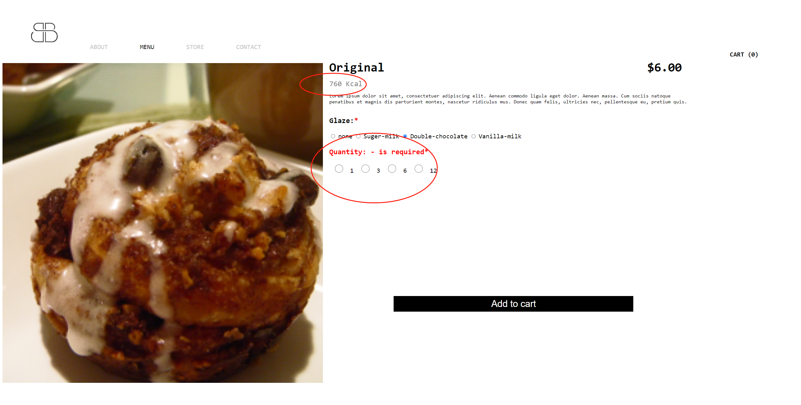

# ReadMe

I only implement the JavaScript function for the first item in the menu.   
When users change the glaze the Cal will also change.  
If users didn’t select both glaze and quantity, there will show some hint/error message.
